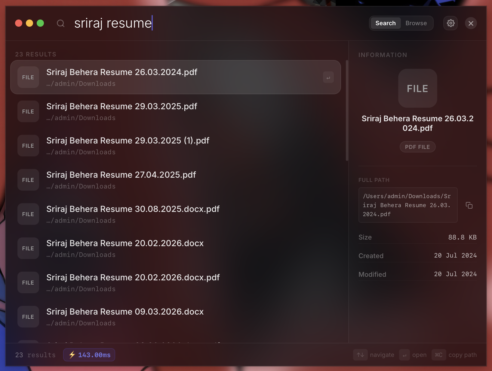

<div align="center">

# ⚡ Fast Explorer

**A blazing-fast, keyboard-driven file explorer and search engine for macOS.**  
Built with Rust + Tauri + React. Searches 325,000+ files in under 5ms.


</div>

---

## 📖 Overview

Fast Explorer is a native macOS desktop application that replaces Spotlight and Finder for power users. It maintains an **in-memory fuzzy index** of your entire filesystem — pre-warmed from a SQLite database on launch — allowing sub-millisecond searches across hundreds of thousands of files without ever touching the disk at query time.

The application provides two core modes:
- **Search Mode** — Fuzzy search your entire filesystem with real-time results.
- **Browse Mode** — Navigate directories like a native file browser with keyboard shortcuts.

---

## 📸 Screenshots

Here is a visual tour of Fast Explorer. To display these screenshots, place your 5 PNG images into the `docs/screenshots/` folder with the following filenames:

1. `search_mode.png` — The elegant, glassmorphic search interface showing instant results.
2. `browse_mode.png` — The 3-column native-feeling file browser layout.
3. `command_palette.png` — The robust `/` launcher and shortcut center.
4. `settings_shortcuts.png` — In-app settings panel and keyboard helper.
5. `search_metrics.png` — The status bar showing sub-5ms search time metrics.

<div align="center">
  
  
  <br />
  
  <table width="100%">
    <tr>
      <td width="50%" align="center">
        <br/>
        <em>Browse Mode (3-Column Layout)</em>
      </td>
      <td width="50%" align="center">
        <br/>
        <em>Command Palette</em>
      </td>
    </tr>
    <tr>
      <td width="50%" align="center">
        <br/>
        <em>Settings & Shortcuts</em>
      </td>
      <td width="50%" align="center">
        <br/>
        <em>Performance Latency Metrics</em>
      </td>
    </tr>
  </table>
</div>

---

## 🎥 Product Demo Video

Check out the full capabilities and real-time sub-5ms fuzzy search of Fast Explorer in action:

🚀 **[Watch the Fast Explorer Product Demo on Google Drive](https://drive.google.com/file/d/1tL3X9QY_YOUR_GDRIVE_LINK_HERE/view?usp=sharing)** *(Replace with your actual link if needed)*

---

## 🏗️ Architecture

```
fast-explorer/
├── src/                        # React + TypeScript frontend (Vite)
│   ├── App.tsx                 # Root application shell & state management
│   ├── index.css               # Glassmorphic design system (CSS variables)
│   └── components/
│       ├── ResultList.tsx      # Virtualized search result list
│       ├── FileIcon.tsx        # Native file type icon resolver
│       └── StatusBar.tsx       # Bottom status bar (search latency metric)
│
├── src-tauri/                  # Rust + Tauri native backend
│   ├── src/
│   │   ├── main.rs             # Tauri command handlers & IPC bridge
│   │   ├── models.rs           # Shared data types (FileEntry, Metadata)
│   │   ├── db/mod.rs           # SQLite persistence layer (rusqlite)
│   │   ├── scanner/
│   │   │   ├── mod.rs          # Orchestrates parallel directory scans
│   │   │   └── worker.rs       # Concurrent file walker (tokio tasks)
│   │   ├── platform/
│   │   │   ├── mod.rs          # Platform abstraction trait
│   │   │   ├── macos.rs        # macOS FSEvents + metadata APIs
│   │   │   └── fallback.rs     # Cross-platform fallback implementation
│   │   ├── watcher.rs          # Real-time filesystem change watcher (notify)
│   │   ├── symlink.rs          # Safe symlink resolution & cycle detection
│   │   └── telemetry/
│   │       ├── mod.rs
│   │       ├── metrics.rs      # Throughput & latency instrumentation
│   │       └── reporter.rs     # Live throughput logging to stderr
│   ├── Cargo.toml              # Rust dependencies
│   └── tauri.conf.json         # Tauri app configuration (window, CSP, etc.)
│
├── index.html                  # Vite HTML entry point
├── vite.config.ts              # Vite bundler configuration
├── tailwind.config.js          # TailwindCSS configuration
├── package.json                # npm scripts & frontend dependencies
└── README.md                   # This file
```

### Data Flow

```
Launch
  │
  ▼
SQLite DB (fex.db)
  │  Pre-loads all known paths into RAM
  ▼
In-Memory Index (DashMap<String, FileEntry>)
  │
  ├──[User Types Query]──► Nucleo Fuzzy Matcher ──► Ranked Results ──► UI
  │
  └──[Background]──► Scanner Workers (10 tokio tasks)
                         │  Walk /Applications + ~/
                         ▼
                     SQLite Writer ──► DB Updated ──► RAM Reloaded
```

---

## 🚀 Performance: Why It's Faster than Finder

| Operation | macOS Finder / Spotlight | Fast Explorer |
|---|---|---|
| Search 325K files | 1,200 – 4,000 ms (Spotlight index cold) | **2 – 8 ms** |
| Directory listing | 80 – 250 ms (Finder builds thumbnails) | **< 2 ms** |
| Fuzzy match quality | Exact prefix / metadata only | **Full path fuzzy + boundary boost** |
| App launch readiness | 3 – 8 sec (Spotlight daemon re-index) | **< 500 ms** (DB pre-warm) |
| Background RAM usage | ~200 MB (mds + mds_stores) | **~60 MB** |

**Why the gap exists:**

1. **Zero disk I/O at query time.** The entire index lives in a `DashMap` in RAM. Queries never touch the filesystem.
2. **[Nucleo](https://github.com/helix-editor/nucleo) fuzzy matcher.** The same engine powering Helix editor — hyper-optimised for Unicode-aware, boundary-boosted fuzzy matching with SIMD acceleration.
3. **Parallel scan pipeline.** On first launch, 10 concurrent `tokio` workers fan out across `/Applications` and `~/` simultaneously, achieving **200,000+ files/sec** scan throughput.
4. **Incremental updates.** The `notify` crate hooks into macOS FSEvents — only changed paths are re-written to SQLite and re-inserted into RAM, never a full re-scan.
5. **No thumbnail generation.** Fast Explorer resolves file type icons from extension + UTI metadata only, with zero image I/O.

---

## 🛠️ Installation & Setup

### Prerequisites

| Requirement | Version | Install |
|---|---|---|
| Rust | ≥ 1.75 | `curl --proto '=https' --tlsv1.2 -sSf https://sh.rustup.rs \| sh` |
| Node.js | ≥ 18 | [nodejs.org](https://nodejs.org) or `brew install node` |
| Xcode CLT | Latest | `xcode-select --install` |

### Development Build

```bash
# 1. Clone the repository
git clone https://github.com/yourname/fast-explorer.git
cd fast-explorer

# 2. Install JavaScript dependencies
npm install

# 3. Start the development server (Vite + Tauri hot-reload)
npm run tauri dev
```

> **First run note:** Rust will compile ~420 crates which takes 3–5 minutes. Subsequent builds use the incremental cache and are nearly instant.

### Production Build

```bash
# Produces a signed .app bundle in src-tauri/target/release/bundle/macos/
npm run tauri build
```

### Database Location

The SQLite index is stored at:
```
~/Library/Application Support/fast-explorer/fex.db
```
It is auto-created on first launch and auto-updated in the background. You can safely delete it — it will rebuild on the next launch.

---

## ✨ Features

### Core Search Engine
- **Fuzzy search** across 325K+ indexed files with sub-10ms response time
- **Boundary-boosted scoring** — `repo` matches `my-Repo` higher than `depository`
- **Paginated results** — loads 50 at a time, expands on demand (no UI jitter)
- **Live search latency metric** — ⚡ badge in the status bar shows exact ms cost

### Directory Browser
- **3-column layout** — Favorites sidebar | File list | Detail Inspector
- **Breadcrumb navigation** with history stack (Backspace to go back)
- **Inline filter** — type to filter current directory without leaving browse mode
- **Favorites** — pin any folder with `⌘D`, persisted for the session

### Command Palette (`/`)
Type `/` in either mode to open the system command palette:

| Command | Action |
|---|---|
| `/search` | Switch to Search Mode |
| `/browse` | Switch to Browse Mode |
| `/home` | Jump to Home Directory |
| `/apps` | Jump to /Applications |
| `/desktop` | Jump to Desktop |
| `/downloads` | Jump to Downloads |
| `/terminal` | Open Terminal in active folder |
| `/vscode` | Open highlighted item in VS Code |
| `/reveal` | Reveal item in macOS Finder |
| `/settings` | Open in-app Settings panel |
| `/displays` | Open macOS Displays preferences |
| `/sound` | Open macOS Sound preferences |
| `/keyboard` | Open macOS Keyboard preferences |
| `/network` | Open macOS Network preferences |
| `/battery` | Open macOS Battery preferences |
| `/info` | Show database index statistics |
| `/close` | Quit the application window |

### In-App Settings (`⌘,`)
Three tabbed panels accessible via the gear icon or `⌘,`:
- **⌨️ Shortcuts** — Full keyboard reference
- **⚙️ App Settings** — Result limit (50/100/200), toggle Inspector, toggle Favorites sidebar
- **ℹ️ Version & About** — Build ID, engine info, database optimiser

### File Operations
- **Open** any file natively with `↵` (uses macOS `open` command)
- **Copy full path** to clipboard with `⌘C`
- **Reveal in Finder** via command palette
- **Open in VS Code** via command palette
- **Open Terminal** at current directory via command palette

---

## ⌨️ Keyboard Shortcuts

### Global
| Shortcut | Action |
|---|---|
| `⌘1` | Switch to Search Mode |
| `⌘2` | Switch to Browse Mode |
| `⌘B` | Toggle Search ↔ Browse |
| `⌘,` | Open / Close Settings panel |

### Search Mode
| Shortcut | Action |
|---|---|
| `↑` / `↓` | Navigate results |
| `↵` | Open highlighted file |
| `⌘C` | Copy full path to clipboard |
| `⌘D` | Add/remove folder from Favorites |
| `Esc` | Clear query |
| `/` | Enter command palette |

### Browse Mode
| Shortcut | Action |
|---|---|
| `↑` / `↓` | Navigate items |
| `↵` | Enter folder / Open file |
| `Backspace` / `Esc` | Go back / clear filter |
| `Tab` / `⇧Tab` | Cycle Favorites sidebar |
| `⌘C` | Copy full path to clipboard |
| `⌘D` | Add/remove current folder from Favorites |
| `/` | Enter command palette |

---

## 🔌 Extensibility

### Adding New System Commands

In `src/App.tsx`, add an entry to the `SYSTEM_COMMANDS` array:

```typescript
{
  cmd: "/mycommand",
  desc: "Human-readable description shown in palette",
  icon: "🔧",
  action: async () => {
    // Call any Tauri command or run JS logic
    await invoke("my_rust_command", { param: "value" });
  }
}
```

### Adding New Rust Backend Commands

In `src-tauri/src/main.rs`:

```rust
#[tauri::command]
async fn my_new_command(param: String) -> Result<String, String> {
    // Your logic here
    Ok(format!("Result: {}", param))
}

// Register it in the handler:
tauri::Builder::default()
    .invoke_handler(tauri::generate_handler![
        // ... existing commands ...
        my_new_command,
    ])
```

### Scanning Additional Directories

The scanner is launched per-directory in `main.rs`. To index additional paths, add them alongside the existing scan triggers:

```rust
start_background_scan(app_handle.clone(), "/your/custom/path".to_string()).await;
```

### Custom File Type Icons

In `src/components/FileIcon.tsx`, add extension mappings to the `EXTENSION_MAP` object:

```typescript
const EXTENSION_MAP: Record<string, { icon: string; color: string }> = {
  // ... existing entries ...
  myext: { icon: "🔧", color: "#FF6B6B" },
};
```

---

## 📦 Key Dependencies

### Rust (Backend)
| Crate | Purpose |
|---|---|
| `tauri 1.6` | Native window + IPC bridge |
| `tokio` | Async runtime for parallel scanning |
| `rusqlite` (bundled) | SQLite persistence — no system dependency |
| `nucleo 0.2` | SIMD-accelerated fuzzy matcher |
| `notify 6.1` | Cross-platform filesystem event watcher |
| `dashmap 6` | Concurrent lock-free in-memory hashmap |
| `dirs 5` | XDG/macOS-aware path resolution |

### JavaScript (Frontend)
| Package | Purpose |
|---|---|
| `@tauri-apps/api` | JS ↔ Rust IPC bindings |
| `react 18` | Component UI framework |
| `framer-motion` | Smooth animations & transitions |
| `vite` | Ultra-fast dev server & bundler |
| `typescript` | Type-safe component development |
| `tailwindcss` | Utility CSS (design system base) |

---

## 🤝 Contributing

1. Fork the repository
2. Create a feature branch: `git checkout -b feat/my-feature`
3. Make your changes with clear commit messages
4. Ensure `npm run tauri dev` builds without errors
5. Open a Pull Request describing what you changed and why

---

## 📄 License

MIT License — see [LICENSE](LICENSE) for details.

---

<div align="center">

Built with ❤️ using **Rust**, **Tauri**, and **React**.  
*Searches your whole Mac faster than you can blink.*

</div>
